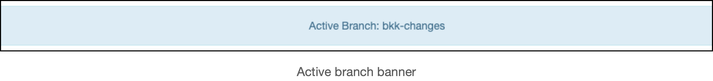

# Motivation
Nautobot is an open source Network Source of Truth and Network Automation Platform. 
Nautobot provides a number of features to validate its data model and safeguard network configuration from errors. 
Adding database versioning with Dolt provides another layer of assurance by enabling human review of changesets and database rollback in the case of errors. 
Dolt’s branch and merge versioning model allows operators to safely modify the data model on feature branches, merging to production only after validation is complete.

## Dolt
Dolt is a MySQL compatible relational database that supports Git-like versioning features. 
Git version files, Dolt versions database tables. 
Running Nautobot on Dolt means operators can use version-control workflows from software development when managing the network data model.

Dolt is built on top of a custom storage layer that supports structural sharing and efficient diff operations. 
At the core of Dolt’s storage are Prolly Trees, an index data-structure that combines properties of B-Trees and Merkle Trees.  
Prolly trees allow the database to maintain multiple versions of a database table without duplicating any of the tree nodes that make up the table storage. 
Further, each of the nodes is content-addressable, meaning that Dolt can compare different versions of the database using the same performant algorithms that Git uses to compare versions of source files. 
The result is a relational database that can branch, diff, merge, push and pull.

# Version Control Plugin Design
The core features of the Version Control plugin are commits and branches. 
All database reads and writes happen on a branch. 
All database writes create a commit.

## Branches  
When Nautobot is initialized with the version control app, the database has a single branch “main”. 
The main branch represents the state of the production data model.
Main also has a special status in that it cannot be deleted. 
New branches are created by specifying a starting branch to start from.


All requests served through the web interface or API fetch data from a specific database branch. 
The choice of branch is encoded in the request by the client. 
For web requests, the branch state is stored in a cookie using Django cookie sessions. 
For API requests, the branch state is encoded in a request header.

When the server receives a request, it looks for this state and uses it to select the correct database branch to serve this request. 
If the branch cannot be found or if the requested branch does not exist, the main branch is used. 
The business logic to handle branch selection is performed in middleware specifically in DoltBranchMiddleware. 
In the web interface, a banner is displayed to notify the user of their “active” branch



Database versioning happens on a per-connection basis. Each connection will read from a specific branch. 
Database connections outside of the web server, such as through nbshell are also versioned. 
When connecting directly to the database you can check your current branch with the active_branch() function and switch branches with the checkout() method:

```python
>>> from dolt.models import Branch
>>> from dolt.utils import active_branch
>>> active_branch()
    'main'
>>> Branch.objects.get(name="foo").checkout()
>>> active_branch()
    'foo'
```

## Commits
A Dolt commit is made for every modification to the data model. 
Each request that writes to the database triggers a commit to be written. 
The result is a granular change log tracking the history of changes made.


Each commit can be individually inspected to see a diff view: a summary of the changes made within that commit.


The committing logic is implemented using a combination of middleware and Django signals, specifically DoltAutoCommitMiddleWare. 
DoltAutoCommitMiddleWare wraps every server request in a AutoDoltCommit context manager which listens for and responds to database writes made while processing the request. 
AutoDoltCommit listens for signals fired by Django model updates and makes a Dolt commit if updates were made during the lifetime of the context manager. 
The message for the commit is derived from the model signals that were captured.

Changes made within a commit can be undone by reverting the commit.


Reverting a commit causes the database to apply the “reverse patch” of the commits in the reversion, much like Git revert. 
Reverting commits, rather than deleting them, has the benefit of keeping all changes made in change history. 
Commit reversion may fail if applying the reverse patch will cause an inconsistency in the data model. 
Specifically if the reversion causes a foreign key or unique key violation in the database, the operation will fail and no changes will be applied.

## Pull Requests
Changes from different branches can be combined using Pull Requests (PRs). 
A successful PR will result in merging the source branch into the destination branch. 
The recommended workflow for the Version Control plugin is to make all changes on a non-production branch and merge the change to the main branch only after it undergoes human review.

The primary Pull Request view has four sub views. 
The “Diffs” tab displays metadata about the PR and a summary of changes made, much like the diff view of a commit. 
However, the PR diff view combines the changes from all of the commits in the PR’s “source branch”. 
In the “Commits” tab there is a list of each commit in the PR. 
The “Conflicts” tab shows any problems that would prevent the PR from being merged. 
Finally, the “Reviews” tab contains a simple forum-like interface where users can discuss and approve PRs.


Pull Request Reviews can take the form of a “comment”, an “approval”, or a “block” of the PR. 
Comments are meant for general discussion. 
Approvals will allow the PR to be merged. 
Blocks will prevent the PR from being merged. 
The most recent non-comment review takes precedence in determining the ability to merge the PR. 
In order to be merged, the Pull Request must also be free of conflicts. 
Conflicts are created when the Dolt cannot successfully merge the data from two versions of a table. 
Conflicts are caused by concurrent modifications of a single model field, or by referential integrity errors such as Foreign Key and Unique Key violations. 
Within the PR view, conflicts are determined by pre-computing the merge with a “Merge Candidate”.

# API Documentation

## API EndPoints
- Branch
- Commit
- Pull Request 
- Pull Request Reviews
- Diffs available?
- Conflicts available?
## How to Supply Versioning
- Example

# Implementation Details

## DoltSystemTables
DoltSystemTable is an abstract base class that forms the basis of Django models that expose Dolt system tables to the Object Relational Mapping (ORM). 
Plugin models such as Commit and Branch that inherit from DoltSystemTable are unmanaged meaning that Django will ignore these models for the purposes of database migrations. 
This is important because Dolt system tables exist from the time the database is created and cannot be modified or deleted. 
Internally, Dolt generates system table data on-the-fly rather than reading it from a traditional database index.

## BranchMeta
The Branch model is one such "unmanaged" model. 
It exposes the dolt_branches system table to the ORM. 
System tables have a static schema, so additional object fields such as "created by" and "source branch" must be stored in another model. 
The BranchMeta model does exactly that. 
Each Branch object has an associated BranchMeta object where the `BranchMeta.branch field` is equal to the name field of the associated branch. 
However, this relationship is not formalized with a Foreign Key due to limitations with the dolt_branches table.
Branch objects lookup their associated BranchMeta objects on a best-effort basis.

## Merge Candidates
The Version Control plugin prevents Pull Requests from being merged if it will create merge conflicts. 
In order to determine if merging a Pull Request will cause conflicts, the merge is precomputed when rendering the PR view. 
The result of pre-computing this merge is called a “merge candidate”. 
Merge candidates are generated by making a hidden branch starting at the tip of the PRs destination branch, and merging the PRs source branch into this new branch. 
The resulting merge candidate is then inspected for merge conflicts. 
Merge candidates are generated on demand when a PR view is rendered, unless a valid merge candidate has already been cached. 
If the source and destination branch of a PR are unchanged since the merge candidate was computed, it is considered valid.

## Versioned Models
Within the Nautobot data model, database models are divided into two groups: versioned and non-versioned. 
Generally speaking, database models that represent a part of the network state will be versioned models (e.g. Devices, IP Addresses, Sites). 
Database models that are specific to the Nautobot application (e.g. Users, Web Hooks, Permissions) will not be versioned. 
Versioning features are restricted for some models such that they have a single “global” state. 
This is especially important for models that affect permissions and authentication: we need a single place where we can read and update security-sensitive data.

Versioned and non-versioned models have different behavior when working on a non-main feature branch. 
Versioned models will be read from the tip of the feature branch. 
Versioned models can also be edited on a feature branch and the edits will be versioned in commits. 
Non-versioned models cannot be edited on feature branches, they must only be edited on the main branch. 
Non-versioned models will also always be read from the tip of the main branch, rather than from a feature branch, regardless of what branch is specified in a request. 
Non-versioned models can’t have multiple versions. There is always a single version which is read-from, and edited on main.

## Global State Router
The business logic for differentiating versioned and non-versioned models is implemented in a Django database router, specifically the GlobalStateRouter. 
The GlobalStateRouter is responsible for choosing a database connection to read an object from or write an object to, depending on its model class. 
There are two connections to choose from when accessing the database. 
The “default” connection will access the database on the Dolt branch that was specified in the request. 
This connection is used to read and write versioned models. 
The “global” connection always accesses the database on the main branch, it is used for non-versioned models.

In order to choose a connection for a model, the router first references the versioned model registry to determine if the model is under version control. 
Currently, this registry is a hardcoded mapping from ContentType to versioned/non-versioned. 
Future work in Nautobot core will make it possible for models to declare themselves whether they should be version controlled.

Database connections for versioned and non-versioned models are defined in the nautobot_config file. 
The database configuration is as follows:
```python
DATABASES = {
    "default": {
        "NAME": "nautobot",  # Database name
        "USER": os.getenv("DOLT_USER", ""),  # Database username
        "PASSWORD": os.getenv("DOLT_PASSWORD", ""),  # Database password
        "HOST": os.getenv("DOLT_HOST", "localhost"),  # Database server
        "PORT": os.getenv("DOLT_PORT", ""),  # Database port
        "ENGINE": "django.db.backends.mysql",
    },
    "global": {
        "NAME": "nautobot",  # Database username
        "USER": os.getenv("DOLT_USER", ""),  # Database username
        "PASSWORD": os.getenv("DOLT_PASSWORD", ""),  # Database password
        "HOST": os.getenv("DOLT_HOST", "localhost"),  # Database server
        "PORT": os.getenv("DOLT_PORT", ""),  # Database port
        "ENGINE": "django.db.backends.mysql",
        "TEST": {
            "MIRROR": "default",
        },
    },
}
```

These two database connections are logically separate at the Django layer, but in fact point to the same physical Dolt instance. 
The “default” database handles versioned models, the “global” database handles non-versioned models. 
For test purposes, the databases are configured as replicas. 
The “TEST” entry in the config dict for the “global” database is a primary/replica configuration for testing. 
This indicates that under testing “global” should be treated as a mirror of “default”.

## Diff Tables
Diff views are rendered for Commits and Branches. 
Object changes are rendered in a list view, grouped by model, and annotated with diff information. 
New objects are highlighted in green, deleted objects in red, and modified objects in gold.


Diff views are derived directly from model list views in Nautobot core. 
Each diff table in the diff view displays the same columns as the table in the associated model list view, with the addition of the “Diff Type” column.

Diff table classes are subclasses of their associated 
