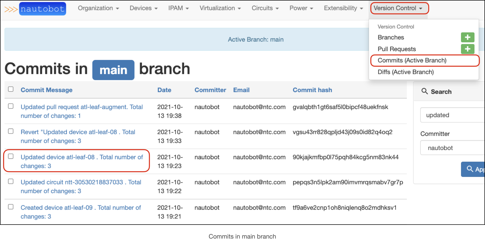
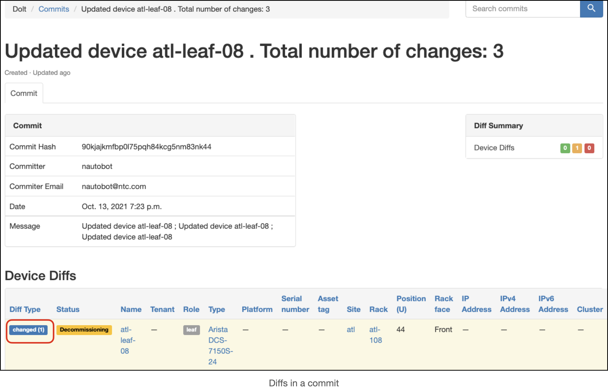
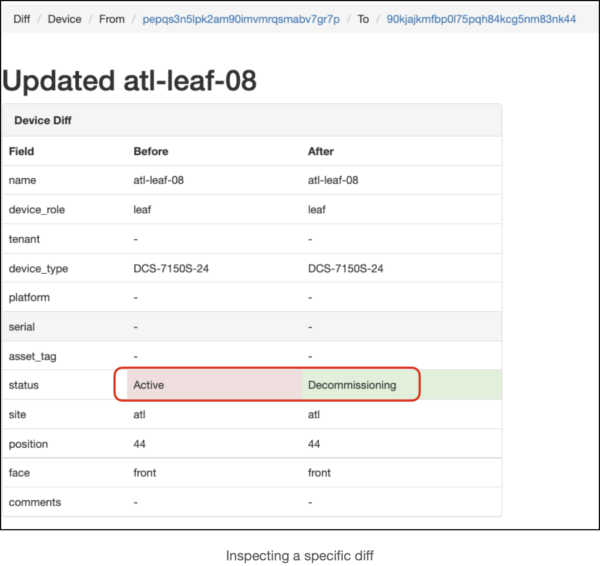
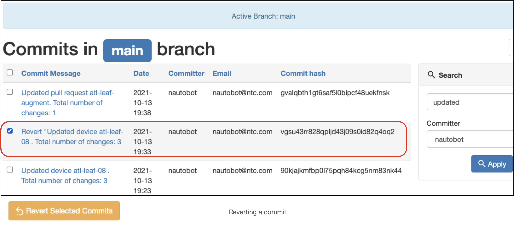

# Using the App

This document describes common use-cases and scenarios for this App.

## General Usage - Version Control Operations

This section describes common Git-like operations that the Version Control app enables on the Nautobot database.

### Branches

When Nautobot is initialized with the Version Control app, the database has a single branch "main". The main branch represents the state of the production data model. `Main` also has a special status in that it cannot be deleted.

New branches are created by specifying a starting branch to start from.

#### Switching Branches

Users can switch between branches by activating a different branch.

To activate a different branch:

1. Navigate to `Version Control --> Branches`
2. Select the branch of interest and click on `Activate`

The selected branch will then become active.

### Commits

A Dolt commit is made for every modification to the data model: each time the user clicks on a `Create`, `Update`, or `Delete` button, it triggers a request that writes to the database.

Each request that writes to the database triggers a commit to be written.
The result is a granular change log tracking the history of changes made.

Each commit can be individually inspected to see a diff view: a summary of the changes made within that commit.

You can inspect the specific changes in a diff by clicking the `Diff Type` badge for a given diff. The example above shows that you can click the `changed` badge for the diff and view the actual data change.

This example shows that the device *status* was changed from `Active` to `Decommissioning`:

#### Reverting a commit

Changes made within a commit can be undone by reverting the commit. When viewing the commits for a branch, users can select one, multiple, or all commits in the branch for reversion. Once the commits are selected, scroll down to the `Revert Selected Commits` button.

After the `Revert Selected Commits` is clicked, the user will see a page asking to confirm the reversion. The user can inspect the change they are making by clicking on the commit message for the commit.

If everything looks good, click the `Confirm` button.

Reverting a commit causes the database to apply the "reverse patch" of the commits in the reversion, much like [Git revert](https://git-scm.com/docs/git-revert). Reverting commits, rather than deleting them, has the benefit of keeping all changes made in change history.

!!! warning
    Commit reversion may fail if applying the reverse patch will cause an inconsistency in the data model. Specifically if the reversion causes a foreign key or unique key violation in the database, the operation will fail and no changes will be applied.

### Pull Requests

Changes from different branches can be combined using Pull Requests (PRs).
A successful PR will result in merging the source branch into the destination branch.

The recommended workflow for the Version Control app is to make all changes on a non-production branch and merge the change to the main branch only after it undergoes human review.

#### Pull Request View

Once a Pull Request (PR) is created, users can access the pull request info by navigating to *Version Control --> Pull Requests* and selecting the pull request of interest.

The primary Pull Request view has four sub-views:

- The "Diffs" tab displays a diff summary, metadata about the PR, and a list of all the diffs between the current branch and the starting branch.
- In the "Commits" tab there is a list of each commit in the PR.
- The "Conflicts" tab shows any problems that would prevent the PR from being merged.
- The "Reviews" tab contains a simple forum-like interface where users can discuss and approve PRs.

#### Pull Request (PR) Reviews

Pull request (PR) reviews allow discussion about the contents of the PR, similar to PR discussions on GitHub.

Version Control app PR reviews can take the form of a "comment", an "approval", or a "block" of the PR:

- *Comments* are meant for general discussion.
- *Approvals* will allow the PR to be merged.
- *Blocks* will prevent the PR from being merged.

#### Conflicts

The most recent non-comment review (Block/Approval) takes precedence in determining the ability to merge the PR. In order to be merged, the Pull Request must also be free of conflicts.

Conflicts are created when the Dolt cannot successfully merge the data from two versions of a table. Conflicts are caused by concurrent modifications of a single model field, or by referential integrity errors such as Foreign Key and Unique Key violations.

Within the PR view, conflicts are determined by pre-computing the merge with a "Merge Candidate". Once a PR is conflict free, it can be merged into its destination branch.

#### Merges

When a PR's status is set to *Approved*, a *Merge* button will appear on the PR screen:

Selecting *Merge* from the pull request view will navigate the user to a confirmation page:

Here the user can inspect the diff before choosing to *merge* or *squash merge* the changes.

*Squash merging* in Dolt has the same semantic meaning as [`git merge --squash`](https://git-scm.com/docs/git-merge#Documentation/git-merge.txt---squash): the history of the source branch is compacted into a single commit.

#### *Catching Up* A Branch

The most common use case for pull requests is merging "feature branches" into the main branch. This is consistent with a [trunk-based](https://www.atlassian.com/continuous-delivery/continuous-integration/trunk-based-development)
change workflow where changes are made on short-lived branches in incremental steps.

Each step branches off from main and merges back to main after a small number of commits. If ever there are long-lived feature branches, it can become difficult to merge back to main due to merge conflicts. This problem can be mitigated by "catching up" a feature branch, by merge the main branch into it.

From the branch list view, we can see a "Catchup" button that will do exactly that. Following this button will take us to a pull request creation form pre-populated with main as the source branch and the feature branch as destination branch.

Creating such a pull request will allow us to inspect any conflicts between the branches and to update the feature branch if none exist.

## Use-cases and common workflows

Common workflows are documented in a [dedicated section](common_workflows.md). Make sure you read through the previous [General Usage - Version Control Operations](#general-usage-version-control-operations) section first!

## Screenshots

The [General Usage - Version Control Operations](#general-usage-version-control-operations) and the [Common Workflows](common_workflows.md) provide many examples with screenshots.
