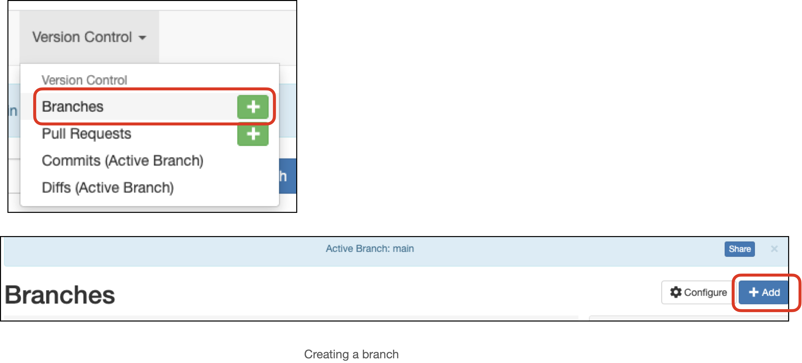
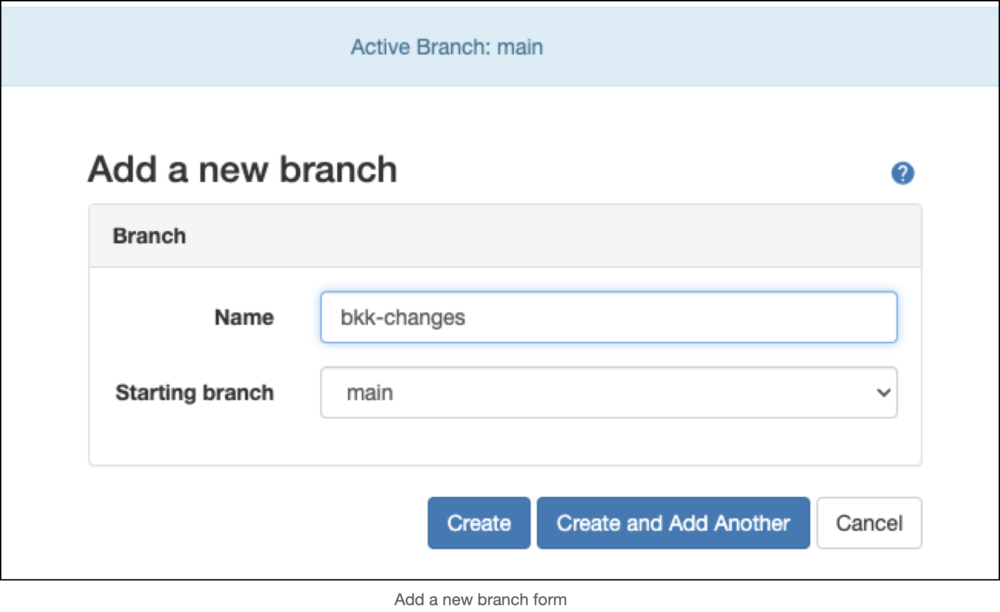
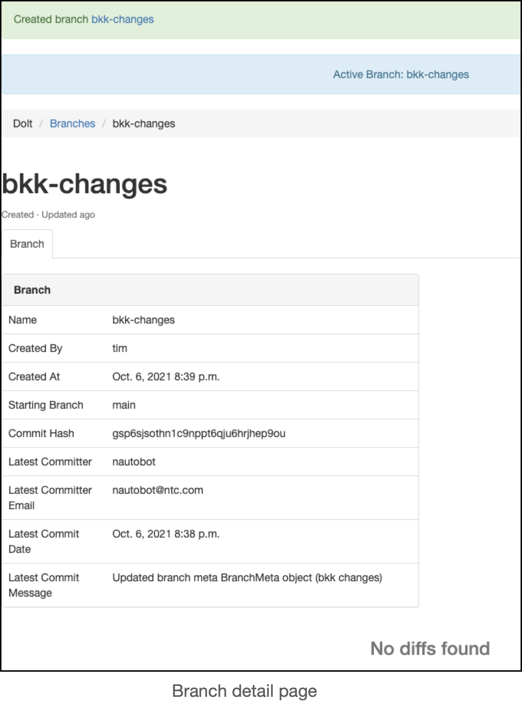
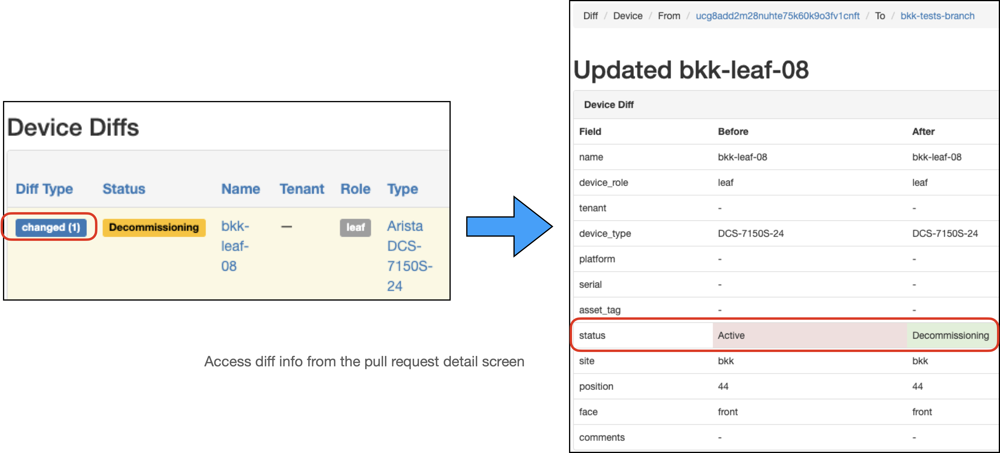
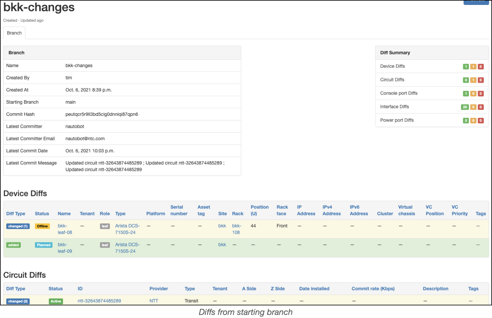
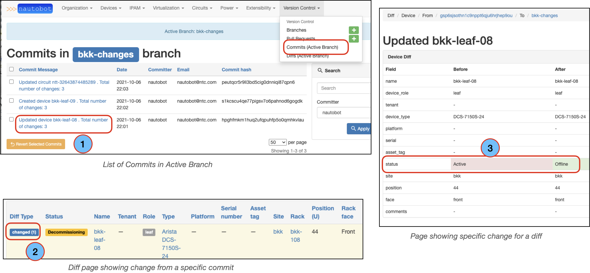
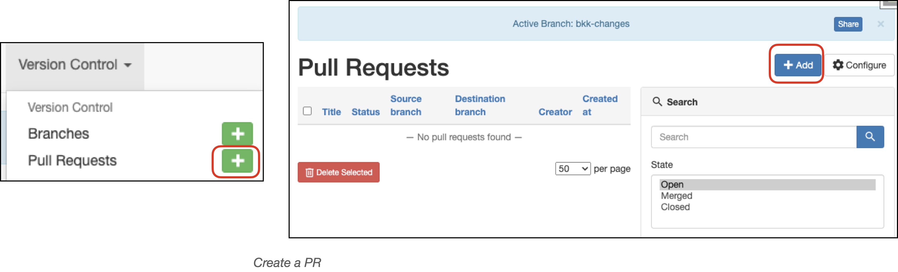
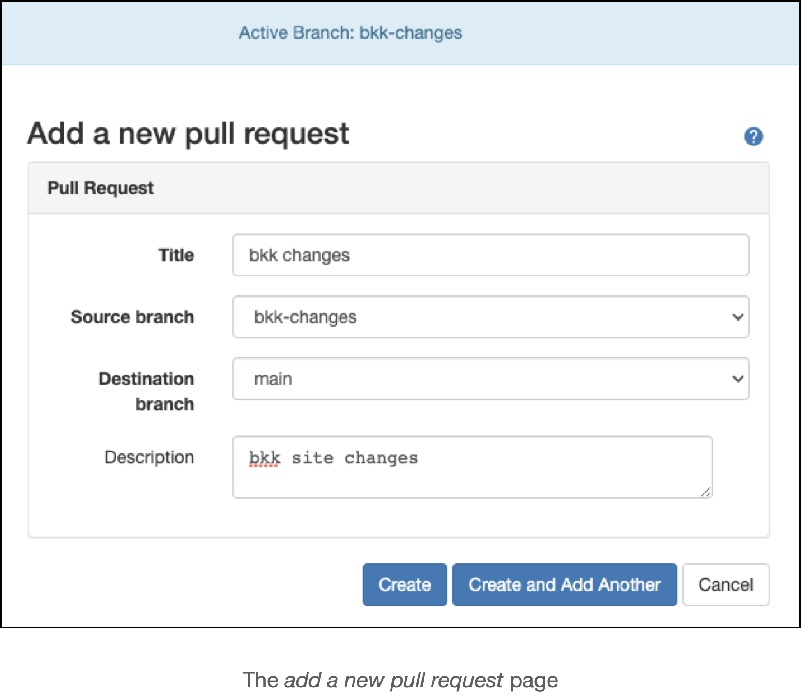
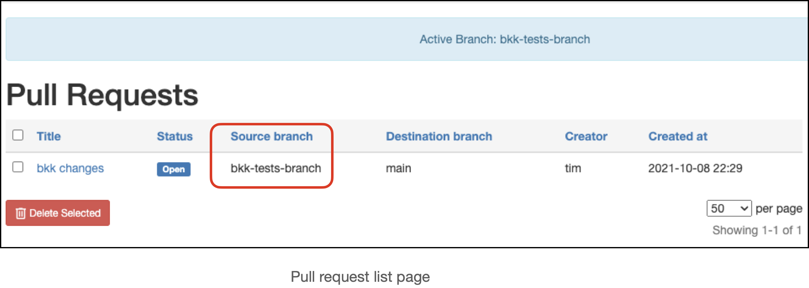

# Common Workflows

This section covers some common workflows. 
It is recommended to review the [version control operations](../version-control-operations.md) section prior to this section.

## Proposing Data Changes

### Creating A Branch

To create a new branch, navigate to *Version Control --> Branches --> +* or *Version Control --> Branches --> + Add*.

Fill out the form, filling in the Name and selecting the starting branch (defaults to *main*).

> **NOTE**: The branch name must be in slug form, consisting of letters, numbers, underscores or hyphens (no spaces).

Click the *Create* button.

Once the branch is created:
* You will be taken to the detail view for the branch
* A banner will appear, notifying you that the branch was created
* A second banner will appear, showing that the newly created branch is now the active branch

### Making Changes To The Data

Any changes to data in Nautobot will be limited to the active branch. To avoid making changes to production data, ensure a non-main branch is active:
* Create a new branch: upon creation, that branch will become active
* Switch to an existing non-main branch: *Version Control --> Branches --> 'Activate' a non-main branch*

You should see a banner indicating that the created/selected branch is the *Active Branch*.

Make changes to the data as necessary in that branch.

### Reviewing Changes

To review changes in your branch (compared to the starting branch): *Version Control --> Diffs*.

The diffs page contains:
1. A panel on the left hand side with meta data about the PR
2. A panel on the right hand side with a diff summary for the PR
  * The number of adds, changes, and deletions in the PR are highlighted in green, orange, and red, respectively
  * Clicking on a section of the diff summary will take you to the detailed changes for that section
3. The detailed diffs, organized by sections (Device, Circuit, Console port, Interface, Power port)

In the detailed diffs section, there is a **Diff Type** column; this column contains a badge with the type of change (*added/changed/deleted*).

Clicking on the **Diff Type** badge for a specific change takes you to the specific change for that diff.

The example below shows that the `bkk-leaf-08` status changed from `Active` to `Decommissioning` in that diff:

Use the *diffs* page to review/confirm your changes prior to submitting a pull request (PR) to merge the changes into the main (production) branch.

### Viewing Branch Commits

To view commits in a given branch, [activate the branch](../version-control-operations.md#switching-branches) with the commits you are interested in. 

While the given branch is active, navigate to *Version Control --> Commits*:
  1. Clicking on a given commit will take you to a screen with the commit diffs
  2. Clicking on the badge for a diff in the **Diff Type** column will take you to the change for that diff   
  3. Once on the *diffs* screen, clicking on a given `Diff Type` will take you to the specific change that triggered the commit

## The Pull Request (PR) Process

After reviewing changes on a branch and any specific diffs for the changes, a user will typically want to submit a PR to merge the changes in the branch into the main (production) branch.

### Creating a PR

To create a PR, navigate to  *Version Control --> Pull Requests --> + Add*. You may also create the PR directly from the navigation menu: *Version Control --> Pull Requests -->+* if you don't wish to view all the open PRs prior to creating a PR.

Once on the *Add a new pull request* screen, fill out the requested details and click on *Create*

### The Pull Request (PR) Detail View

Creating the PR will take you to the PR detail page, which has 4 tabs, [explained here](../version-control-operations.md#pull-request-view).

### Reviewing a PR 
Ideally, a different user would review the PR prior to merging the changes into to main branch. 

To review a PR, go to *Version Control --> Pull Requests*.

This will take you to the pull requests list page; once there:
* Determine which PR you want to review
* Switch the active branch to that of the PR source branch (this is necessary if you wish to revert any changes in the PR)
* Navigate back to the PR list page and click on the desired PR

## Reverting Commits

At any point during the process of making changes in a branch, reviewing a PR for the changes in a branch, or trying to revert changes already in the main (production) branch, you may want to revert specific commits or revert commits en masse. View how to revert commits [here](../version-control-operations.md#reverting-a-commit).

